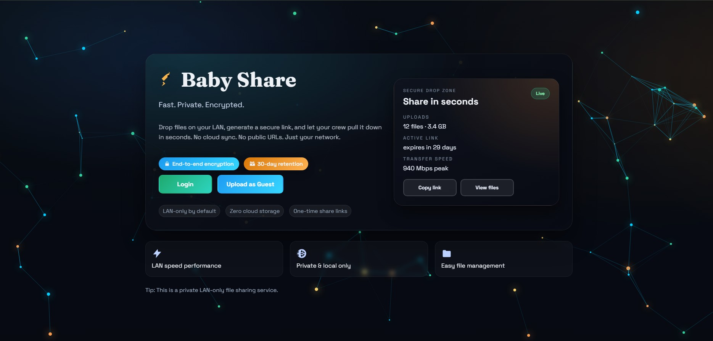

# 🔐 BabyShare

Secure LAN file sharing platform with QR-based device pairing, encrypted transfers, and temporary access control.

> Fast. Private. Encrypted.  
> No cloud sync. No public storage. Just your network.

---

## 📸 Preview

<p align="center">
  
</p>

---

## 🚀 Features

- 🔐 End-to-end encrypted file transfers  
- 📱 QR-based device pairing  
- 👤 Guest upload support  
- 🌐 LAN-only architecture (no cloud dependency)  
- ⏳ Temporary share links with expiration  
- 🛡 Secure session & authentication handling  
- ⚡ High-speed local network transfers  

---

## 🛠 Tech Stack

### Backend
- Node.js
- Express
- Secure session management
- REST API architecture

### Frontend
- React
- TypeScript
- Vite

### Architecture
- LAN-based file distribution
- Encrypted file storage
- Secure link generation
- Backend-served production build

---

## ⚙️ Setup

Install backend dependencies:

```bash
npm install

Install frontend dependencies:
```bash
cd client
npm install
cd ..
```

Create `.env` (optional):
```env
PORT=3000
HTTP_PORT=3001
FILE_KEY=your-secret-key
SESSION_SECRET=your-session-secret
DOMAIN=https://your-domain.com
FORCE_HTTPS=false
SHARE_USE_HTTPS=false
```

## Run (development)

Start backend:
```bash
npm run dev
```

Start frontend dev server (separate terminal):
```bash
npm run client:dev
```

## Build (production)

```bash
npm run build
npm start
```

Then open:
- http://localhost:3000
- Or the LAN IP shown in the terminal

## Notes
- The backend still serves login/register/guest endpoints.
- After build, Express serves the React frontend from `client/dist`.
- If `FORCE_HTTPS=true` and you use a self-signed cert, share links default to HTTP on `HTTP_PORT` to avoid mobile/browser SSL errors. Set `SHARE_USE_HTTPS=true` to force HTTPS links.

